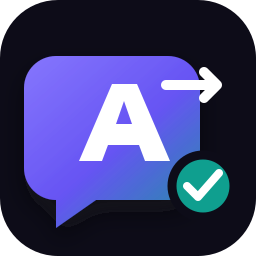

<div align="center">
  
  <h1>Auto Page Translator for Brave</h1>
  <p><strong>Independent, configurable in-page translation for Brave and Chromium browsers.</strong></p>
  <p>
    <a href="https://chromewebstore.google.com/detail/auto-page-translator-for/pilpighhgdglgngmakjepoadacbhpoeo"></a>
    
    
    
    
  </p>
</div>

> [!IMPORTANT]
> This is an independent, unofficial extension. It is not developed, sponsored, or endorsed by Brave Software or Google. Brave includes its own native Translate feature; this project provides a separate rule-driven workflow for users who want one global target language, manual/minimal-access mode, approved-site automation, per-site targets, live-page translation and restorable text.

## Install

[**Install Auto Page Translator for Brave from the Chrome Web Store →**](https://chromewebstore.google.com/detail/auto-page-translator-for/pilpighhgdglgngmakjepoadacbhpoeo)

The Chrome Web Store is the official installation and automatic-update channel for Brave and other Chromium browsers. Brave users can install the extension directly from the listing above.

GitHub is the public source, issue tracker and development home. Development happens in this repository; validated releases are then published to the Chrome Web Store.

## What it does

The extension detects a webpage's primary language and translates readable text directly inside the original page. The site remains on its real address, so logins, Cloudflare checks, cookies, navigation and interactive features are not moved through a translated-page proxy.

- Manual translation with temporary `activeTab` access by default
- Optional automatic translation for approved sites or all permitted sites
- Explicit first-run consent before any webpage text is processed
- Browser language detection combined with the page's declared language
- Per-site targets, site/language exclusions, custom glossary and protected terms
- Live translation for feeds, menus, SPAs and infinite scrolling using an incremental queue
- Open Shadow DOM and accessible frame support, including related `about:`, `data:` and `blob:` frames in automatic modes
- Private-page safeguard for password and payment forms
- Progress, cancellation, provider status and one-click original restoration
- Page, selection and keyboard-shortcut commands
- On-device, Google Cloud, LibreTranslate and disclosed compatibility provider choices
- No analytics, advertising, telemetry or developer-operated translation server

## Install from source (development)

Most users should use the [official Chrome Web Store listing](https://chromewebstore.google.com/detail/auto-page-translator-for/pilpighhgdglgngmakjepoadacbhpoeo). The unpacked route below is intended for contributors, testers and local development.

1. Download or clone this repository.
2. Open `brave://extensions` in Brave.
3. Enable **Developer mode**.
4. Select **Load unpacked**.
5. Choose the repository folder containing `manifest.json`.
6. Complete the privacy and access setup that opens after installation.

The default mode is manual. Automatic access is requested only when selected by the user.

## Provider choices

Automatic provider selection prefers the browser's on-device Translator API where available. A user can configure an official Google Cloud Translation API key or a LibreTranslate server. The current Google web method remains available as a clearly disclosed compatibility fallback rather than the only engine.

Read [docs/PROVIDER_GUIDE.md](docs/PROVIDER_GUIDE.md) before configuring an external service.

## Development

Development and issue tracking happen in this GitHub repository. Store builds are validated and packaged here before publication to the [Chrome Web Store](https://chromewebstore.google.com/detail/auto-page-translator-for/pilpighhgdglgngmakjepoadacbhpoeo).

Requires Node.js 20 or newer.

```bash
npm ci
npm run validate
npm run test:e2e
npm run package
```

`npm run validate` checks the Manifest V3 package, JavaScript syntax, icons, minimum permissions, consent architecture, provider boundaries and unit regressions. Playwright tests load the real extension into Chromium against local fixtures with mocked provider responses.

Tags matching `v*` trigger the release workflow, which validates the extension, builds the ZIP and attaches it to a GitHub Release.

## Keyboard shortcuts

- `Alt+Shift+T`: translate the current page
- `Alt+Shift+O`: restore original page text

Shortcuts can be changed through the browser's extension-shortcut settings.

## Honest limitations

No ordinary browser extension can translate every surface. Browser-internal pages, extension pages, the built-in PDF viewer, text baked into images or video, canvas-rendered text, closed Shadow DOM and some protected or sandboxed frames are inaccessible. Sites can also mark content as non-translatable.

Translation quality and availability depend on the selected provider. The extension fails safely, preserves the original page and provides actionable errors when a provider or permission is unavailable.

## Support and security

- [Support and troubleshooting](SUPPORT.md)
- [Compatibility matrix](docs/COMPATIBILITY.md)
- [Privacy policy](PRIVACY.md)
- [Security policy](SECURITY.md)
- [Changelog](CHANGELOG.md)

## Licence

Released under the [MIT Licence](LICENSE).
